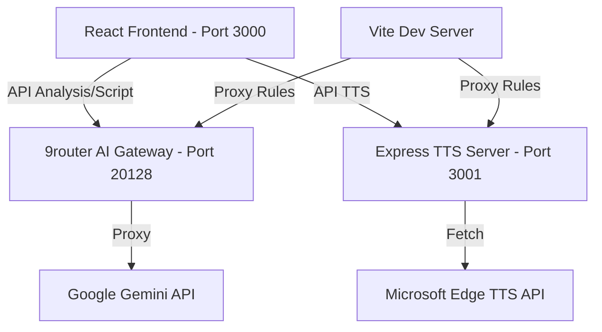

# System Architecture Overview

Dự án YouTube Content Architect sử dụng kiến trúc Hybrid giữa Client-side và Local Backend để tối ưu chi phí và hiệu suất.

## 🏗️ Tổng quan kiến trúc

## 🛠️ Thành phần chính

### 1. Frontend (Vite + React)

- **ScriptWriter.tsx**: UI chính quản lý luồng tạo kịch bản.
- **useAudioPlayer.ts**: Hook quản lý Web Audio API, xử lý giải mã MP3 thành AudioBuffer và quản lý playback state (progress, seek).
- **edgeTtsService.ts**: Wrapper gọi API nội bộ `/api/tts`.

### 2. Backend TTS (Express)

- Chạy trên cổng **3001**.
- Giải quyết vấn đề bảo mật (CORS) và giới hạn môi trường của thư viện TTS (yêu cầu Node.js).
- **Cơ chế Fallback thông minh (Locale-Aware)**: Đảm bảo luồng audio không bao giờ đứt gãy bằng cách dự phòng theo ngôn ngữ:
  - `en-US` → Fallback về `en-US-GuyNeural`.
  - `en-GB` → Fallback về `en-GB-RyanNeural`.
  - `vi-VN` và các hệ khác → Fallback về `vi-VN-HoaiMyNeural`.

### 3. AI Gateway (9router)

- Chạy trên cổng **20128**.
- Cung cấp giao diện OpenAI-compatible cho các model Gemini. giúp dễ dàng thay đổi/fallback model mà không sửa code frontend nhiều.

## 📡 Luồng dữ liệu Audio

1. User nhấn **Tạo Audio**.
2. Frontend gọi `POST /api/tts` (được Vite proxy sang cổng 3001).
3. Backend gọi Edge TTS API, nhận stream audio và gộp thành Buffer.
4. Backend trả về JSON chứa chuỗi **Base64** của file MP3.
5. Frontend giải mã Base64 → ArrayBuffer → AudioBuffer.
6. Frontend khởi tạo timer và thanh tiến trình để phát nhạc.

## 🔐 Cấu hình môi trường (.env.local)

- `GEMINI_API_KEY`: Dùng cho các task yêu cầu SDK gốc.
- `OPENAI_API_KEY`: Dùng cho 9router.
- `VITE_TTS_URL`: Cấu hình endpoint TTS (mặc định trỏ về proxy `/api/tts`).
